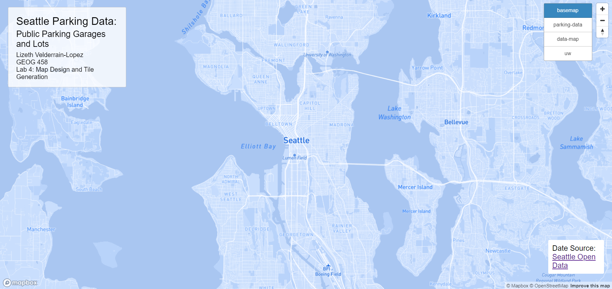
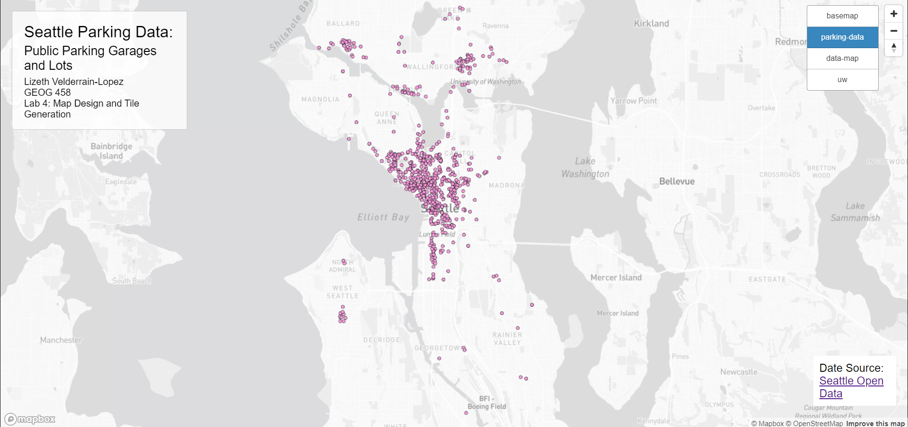
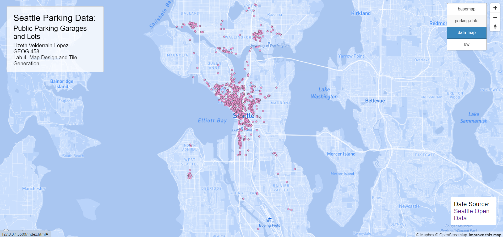
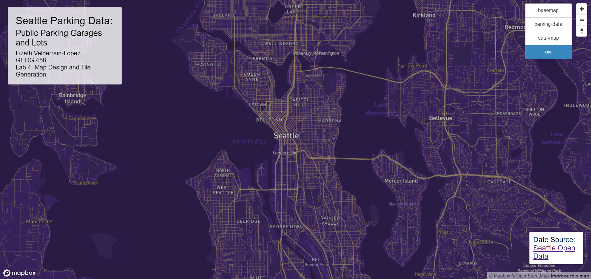

# Seattle Public Parking Data: Garages and Lots
Lizeth Velderrain-Lopez
GEOG 458 AA
Lab 4: Map Design and Tile Generation

This [mapping project](https://lizethvl.github.io/geog458-lab4/index.html) shows the public parking garages and lots in the city of Seattle. Map tiles of different basemaps were created using [MapBox](https://www.mapbox.com/). Each tile set has a zoom level ranging from a minimum of 3 to a maximum of 14. When loading the project, a default MapBox basemap is shown, with four different tile set layers to choose from.

The first layer shows the modified MapBox basemap, stemming from the monochrome style.

The second layer depicts the public parking data of garages and lots through a thematic layer. The source for this data comes from the city of Seattle through [Seattle GeoData](https://data-seattlecitygis.opendata.arcgis.com/datasets/3029d63401544cd6b9783ef1bfb40b91_1/explore?location=47.607962%2C-122.338123%2C12.56), the city's GIS program open data site.

The third layer combines the first two tile sets, depicting the customized basemap from the first layer along with the geospatial data from the second layer.

The fourth layer is another modified basemap, however, it contains a theme. The theme for the basemap is of the University of Washington, which is seen with the distinct colors used representing the university's colors.
